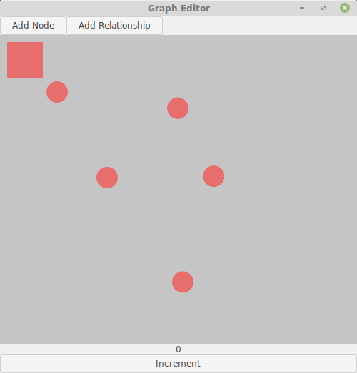

# Graph Editor in Rust

A small application to prototype a model for a graph database. 

The application is written in [Rust](http://rust-lang.org/) using the [GTK toolkit](https://www.gtk.org/).

I use this project as an apportunity to learn Rust and GTK. I choosed these technologies because and want to build something that is light, fast and multi platform.

Planned features: 

* Add nodes
* Create relationships between nodes
* Move nodes
* Manage node label's
* Manage relationship types
* Handle multiple relationships between two nodes
* Handle a node to have a relationship to itself
* Auto layout
* Cypher export

## Run

Prerequisites: 

* [Install Rust tools](https://www.rust-lang.org/en-US/install.html)

Steps: 

1. Checkout the project
2. Start with `cargo run`